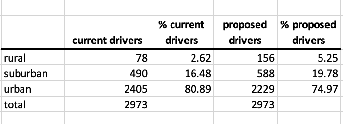

# PyBer_Analysis

## Overview of the Analysis

In this analysis, we looked at data from January through April and calculated:
- total rides by city type
- total drivers by city type
- total amount of fares by city type
- avg fare per ride by city type
- avg fare per driver by city type
- total weekly of the fares for each type of city

### Purpose

The purpose of this analysis is to identify any disparities among the city types and how to address them. The question we want to be able to answer is which type of cities needs more driver support?

# Results

### Analyzing weekly fare sums from January to April

This table shows overall, urban city type has the highest total weekly sums of fares. 
- An average of 63% of total sum of fares comes from urban cities
- Suburban city type represents an average of 30% of total fares
- Rural city type represents an average of 6% of total fares

### Total Rides/Drivers/Fares and Average Fare per Ride/Driver

When you look at the avg fare per ride vs avg fare per driver

- Rural: avg fare per ride   <   avg fare per driver
- Suburban: avg fare per ride    <   avg fare per driver
- Urban: avg fare per ride   >   avg fare per driver 

Average Fare per Ride
- Rural city types have the highest average fare per ride of all city types. This could be from the limited number of drivers working. Meanwhile, urban city types have the lowest avg fare per ride, indicating the more drivers in the market, the lower the avg fare per ride rate.

Average Fare per Driver
- Rural drivers have the highest avg fare per driver, meaning they are the most productive drivers. 

## Summary

### Here are three business recommendations based on the data:
- Increase the number of driver to decrease average fare per ride in the rural city types. Reducing the average fare rate per ride can help make it more affordable for the community to participate in. We can start off by doubling the total drivers. Then see how the average fare per ride decreases. We should expect total rides to increase and total sum of fares to increase. We should expect a slight decrease in average fare per driver since there would be more competition among drivers. If you look at the "Total Fare by City Type" chart, notice how in rural city types, total fares are slowly increasing every month. This is a good indication that this city type is growing and showing interest in ride sharing.

- Suburban city types seem to be more stable, there are smooth and gradual transitions of total sums of fares throughout the month. We should investigate and add 20% more drivers and see how that would affect the average fare per ride and average fare per driver.

- For urban city types, we should reduce drivers by 5% to see if this will help make drivers more productive and increase average fare per driver.

